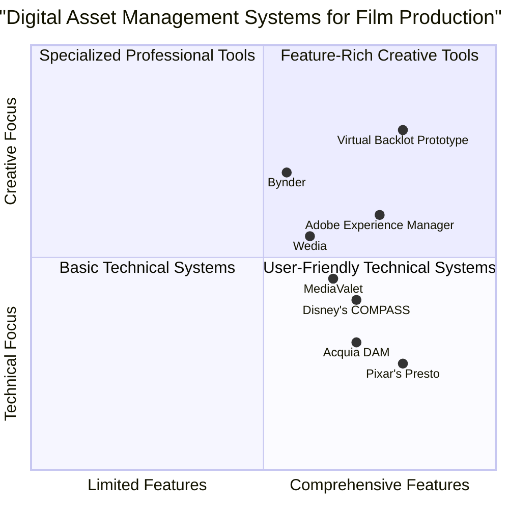

# Product Requirements Document (PRD)

# Virtual Backlot Prototype

**Date:** May 21, 2025  
**Author:** Emma, Product Manager  
**Project:** Virtual Backlot Prototype  
**Version:** 1.0

## 1. Introduction

### 1.1 Purpose
The Virtual Backlot Prototype is a web-based application designed to enhance the creative workflow for film and media professionals. It provides a unified platform for managing themed asset packs, integrating AI-driven tools for advanced search, discovery, and visualization of digital assets used in film production.

### 1.2 Scope
This PRD defines the requirements for the development of the Virtual Backlot Prototype, a comprehensive digital asset management system tailored specifically for film and media production workflows. The system will allow users to browse, search, visualize, and organize 3D assets with advanced features such as real-time pixel-streaming previews, mood board creation, and analytics.

### 1.3 Target Audience
The primary users of the Virtual Backlot Prototype are film and media professionals including:
- Marketing Executives
- Showrunners
- Directors of Photography
- 3D Artists
- System Administrators

### 1.4 Restatement of Original Requirements
Develop a web-based Virtual Backlot Prototype using React, JavaScript, and Tailwind CSS, featuring a unified library view, AI-assisted search and discovery tools, pixel-streaming preview capabilities, snapshot and mood-board creation tools, secure asset download portal, comprehensive analytics dashboard, dark theme implementation, and 3D asset management with photorealistic quality.

## 2. Product Definition

### 2.1 Product Goals

1. **Streamline Discovery:** Empower film and media professionals to quickly find the exact assets they need through intuitive navigation and AI-powered search tools

2. **Enhance Visualization:** Enable users to visualize, customize, and capture high-quality 3D asset previews in real-time for improved creative decision making

3. **Foster Collaboration:** Provide robust tools for creating, sharing, and analyzing mood boards and assets across distributed production teams

### 2.2 User Stories

#### Marketing Executive
As a marketing executive, I want to quickly browse and search for assets using descriptive terms, so that I can find the perfect imagery for promotional campaigns without needing technical 3D expertise.

#### Showrunner
As a showrunner, I want to create visual mood boards with snapshots from multiple assets, so that I can effectively communicate my creative vision to the production team.

#### Director of Photography
As a director of photography, I want to manipulate camera angles and lighting in the 3D asset preview, so that I can plan shots and evaluate virtual locations effectively.

#### 3D Artist
As a 3D artist, I want to download assets in multiple formats with appropriate permissions, so that I can integrate them into my workflow and production pipeline.

#### System Administrator
As a system administrator, I want to access comprehensive usage analytics, so that I can track which assets are most valuable and make informed decisions about future asset acquisitions.

### 2.3 Competitive Analysis

#### MediaValet
**Pros:**
- Strong enterprise-grade security features
- Excellent support for creative and marketing teams
- Robust metadata management

**Cons:**
- Limited 3D asset preview capabilities
- Less intuitive user interface for creative professionals
- Weaker AI-powered search capabilities

#### Wedia
**Pros:**
- Strong distributed marketing capabilities
- Good workflow automation
- Solid asset organization

**Cons:**
- Limited real-time 3D visualization
- Lacks specialized film production features
- Less comprehensive analytics

#### Bynder
**Pros:**
- Excellent brand consistency features
- Strong content optimization
- Good user permission management

**Cons:**
- Less focus on 3D assets
- Weaker real-time collaboration features
- Limited visualization capabilities

#### Acquia DAM (Widen)
**Pros:**
- Strong customization capabilities
- Good integration ecosystem
- Robust asset management workflow

**Cons:**
- Complex interface with steeper learning curve
- Limited 3D preview functionality
- Less film production-specific features

#### Adobe Experience Manager
**Pros:**
- Excellent integration with creative tools
- Strong content creation features
- Robust asset versioning

**Cons:**
- Higher cost than competitors
- Complex implementation
- Heavier system requirements

#### Pixar's Presto (Internal System)
**Pros:**
- Built specifically for film production
- Excellent 3D model management
- Strong integration with animation workflow

**Cons:**
- Not commercially available
- Requires significant technical expertise
- Heavy resource requirements

#### Disney's COMPASS (Internal System)
**Pros:**
- Purpose-built for media management
- Excellent metadata and taxonomy features
- Strong asset tracking capabilities

**Cons:**
- Limited availability outside Disney ecosystem
- Complex integration requirements
- Steeper learning curve

### 2.4 Competitive Quadrant Chart

## 3. Features and Requirements

### 3.1 Unified Library View

#### 3.1.1 Asset Categories
The system MUST support categorization of assets into the following primary categories:
- Environments
- Vehicles
- Props
- Characters
- Promos

#### 3.1.2 Asset Grid Display
The system MUST display assets in a responsive grid layout that adapts to different screen sizes.

#### 3.1.3 Filtering
Users MUST be able to filter assets by:
- Category
- Format
- Creation date
- Tags

#### 3.1.4 Featured Assets
The system MUST highlight featured or recently added assets on the main library view.

### 3.2 Search & Discovery

#### 3.2.1 Basic Search
Users MUST be able to search assets using text-based queries that match against:
- Asset titles
- Descriptions
- Tags and metadata

#### 3.2.2 AI Wand Search
The system MUST provide an AI-powered search feature that allows users to:
- Search using natural language descriptions
- Find assets based on conceptual or abstract descriptions
- View AI-recommended results based on input prompt

#### 3.2.3 Example Queries
The AI Wand MUST provide example queries to guide users, such as:
- "Urban street with neon signs and futuristic buildings"
- "Mid-century modern home interior with natural lighting"

### 3.3 Pixel-Streaming Preview

#### 3.3.1 3D Viewer
The system MUST integrate a Babylon.js-based 3D model viewer with the following capabilities:
- Real-time 3D model display
- Asset rotation, zoom, and pan controls
- Camera position presets (front, side, top, closeup)

#### 3.3.2 Rendering Quality Controls
Users SHOULD be able to toggle between different rendering quality modes:
- Realtime (faster loading, standard quality)
- High Quality (enhanced lighting, shadows, and detail)

#### 3.3.3 Animation Support
The viewer MUST support animated 3D models with:
- Play/pause controls for animations
- Timeline scrubbing (P1)
- Animation speed controls (P2)

### 3.4 Snapshot & Mood Board

#### 3.4.1 Snapshot Capture
Users MUST be able to capture snapshots of the 3D viewer from current camera angles.

#### 3.4.2 Mood Board Creation
Users MUST be able to:
- Create new mood boards
- Add titles and descriptions to mood boards
- Add snapshots to mood boards
- Arrange, resize, and rotate snapshots on the mood board canvas

#### 3.4.3 Mood Board Sharing
Users with appropriate permissions MUST be able to share mood boards with:
- Direct links
- Email options
- Permission controls

### 3.5 Download Portal

#### 3.5.1 Format Options
Users with download permissions MUST be able to download assets in multiple formats:
- Unreal Engine 5
- FBX
- GLB/GLTF
- OBJ
- USD

#### 3.5.2 Permission Controls
The system MUST enforce user permissions for downloads based on user roles.

#### 3.5.3 Download Analytics
The system MUST track downloads for analytics purposes.

### 3.6 Analytics Dashboard

#### 3.6.1 Global Metrics
The analytics dashboard MUST display the following metrics:
- Total views
- Total downloads
- Total favorites

#### 3.6.2 Time-Based Analysis
Users MUST be able to view data trends over customizable time periods with:
- Date range selection
- Comparison to previous periods
- Percentage change indicators

#### 3.6.3 Asset-Specific Analytics
Users MUST be able to view analytics for specific assets including:
- View counts
- Download counts by format
- User role breakdown

#### 3.6.4 Visualizations
The dashboard MUST include the following visualizations:
- Line charts for time-based data
- Pie charts for category distribution
- Table of most popular assets

### 3.7 Dark Theme Implementation

#### 3.7.1 Theme Toggle
Users MUST be able to toggle between light and dark themes.

#### 3.7.2 Persistent Preference
The system SHOULD remember user theme preferences across sessions.

#### 3.7.3 Consistent Application
The dark theme MUST be consistently applied across all components and pages.

### 3.8 User Management

#### 3.8.1 User Roles
The system MUST support the following user roles with appropriate permissions:
- Marketing Executive
- Showrunner
- Director of Photography
- 3D Artist
- Admin User

#### 3.8.2 Permissions
The permission system MUST control access to the following features:
- View assets
- Take snapshots
- Create mood boards
- Share content
- Download assets
- Access analytics
- Administrative functions

## 4. Technical Specifications

### 4.1 Requirements Analysis

The Virtual Backlot Prototype requires a modern web application architecture with the following technical considerations:

- **Front-end Framework**: React provides component-based architecture ideal for the modular UI elements needed across the application
- **Styling**: Tailwind CSS enables rapid responsive UI development with consistent styling
 - **3D Rendering**: Babylon.js integration for browser-based 3D rendering without plugins
- **State Management**: Context API for state management across components
- **Routing**: React Router for navigation between different views
- **Responsive Design**: Mobile-friendly interface using responsive design principles
- **Accessibility**: WCAG 2.1 AA compliance for core functionality

### 4.2 Requirements Pool

#### P0 (Must Have)
- Unified asset library with categories and filtering
- Basic search functionality
- 3D asset viewer with camera controls
- User authentication and role-based permissions
- Snapshot capture from 3D viewer
- Basic mood board creation
- Asset download in multiple formats
- Dark theme support

#### P1 (Should Have)
- AI Wand search functionality
- Advanced mood board editing capabilities
- Analytics dashboard with basic metrics
- Sharing capabilities for mood boards
- Animation controls for 3D assets
- High-quality rendering mode toggle
- Persistent user preferences

#### P2 (Nice to Have)
- Advanced analytics with user role breakdown
- Time-based analytics comparisons
- Animation timeline scrubbing
- Multiple mood board templates
- Social sharing integration
- Batch download functionality
- Custom asset tagging

### 4.3 UI Design Draft

#### Library View
- Navigation sidebar with categories
- Filter panel on left side
- Search bar at top
- AI Wand button for advanced search
- Responsive grid of asset cards
- Featured assets carousel (P1)

#### Asset Detail View
- Breadcrumb navigation
- Asset title and metadata
- 3D viewer with camera controls
- Asset description and tags section
- Download and snapshot buttons
- Related assets section (P2)

#### Mood Board Editor
- Canvas area with grid background
- Draggable snapshot items
- Control panel for item manipulation
- Title and description fields
- Save and share buttons

#### Analytics Dashboard
- Date range selector
- Key metrics cards
- Line charts for time-based data
- Pie charts for distributions
- Table of top assets
- Asset selector for detailed analysis

### 4.4 Open Questions

1. **Persistence Strategy**: Should user data be stored in Supabase or localStorage? This affects scalability and multi-device synchronization.

2. **AI Implementation**: What specific AI model will power the AI Wand feature? This impacts accuracy and resource requirements.

3. **3D Format Support**: Which additional 3D formats should be supported beyond the current list? This affects compatibility with different production workflows.

4. **Authentication Method**: What authentication provider should be integrated? This affects security and user management complexity.

5. **Scalability Concerns**: How should the application handle very large asset libraries? This impacts performance and user experience.

## 5. Timeline and Milestones

### 5.1 Phase 1: Foundation (4 weeks)
- Core user interface implementation
- Asset library and basic search
- 3D viewer integration
- User authentication

### 5.2 Phase 2: Core Features (6 weeks)
- Snapshot functionality
- Mood board creation
- Download portal
- Dark theme implementation

### 5.3 Phase 3: Advanced Features (4 weeks)
- AI Wand search integration
- Analytics dashboard
- Sharing capabilities
- High-quality rendering options

### 5.4 Phase 4: Refinement (2 weeks)
- Performance optimization
- User testing and feedback incorporation
- Bug fixes and UI polish
- Documentation

## 6. Success Metrics

### 6.1 User Engagement
- 80% of target users should use the system at least weekly
- Average session duration should exceed 15 minutes
- At least 50% of users should create a mood board within first month

### 6.2 Efficiency Improvements
- 40% reduction in time to find appropriate assets compared to current processes
- 60% increase in asset reuse across productions
- 30% reduction in back-and-forth communications regarding asset selection

### 6.3 Technical Performance
- Page load time under 2 seconds for library view
- 3D asset loading time under 5 seconds for standard assets
- System uptime of 99.9%
- Support for concurrent users scaling to 500+

## 7. Appendix

### 7.1 Glossary

- **Asset**: A 3D model or resource used in film production
- **Mood Board**: A collection of visual elements arranged to convey a style or concept
- **Pixel-Streaming**: Technology for streaming real-time rendering from server to client
- **AI Wand**: The AI-powered search feature for conceptual asset discovery
- **Snapshot**: A captured image of the 3D viewer at a specific camera angle

### 7.2 References

- Existing code base located at `/data/chats/imvead/workspace/`
- Industry standards for digital asset management
- Competitive analysis of existing DAM solutions
