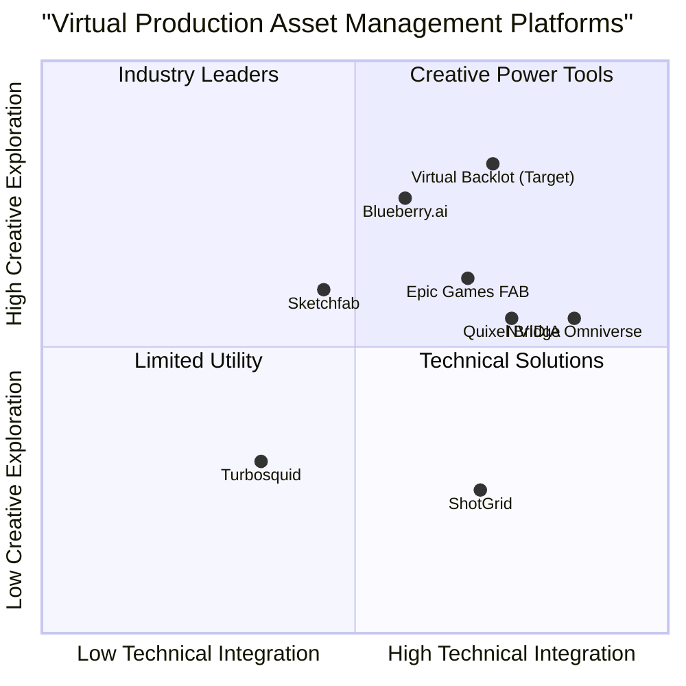

# Product Requirements Document: Virtual Backlot Prototype

## Project Information

**Project Name:** virtual_backlot_prototype
**Programming Language:** React, JavaScript, Tailwind CSS
**Date:** 2025-05-14

## Original Requirements

Build an interactive, browser-based prototype of the "Virtual Backlot" platform for Paramount's CBS VFX team. The prototype should demonstrate the end-to-end Day One MVP user journey—Discover → Preview → Snapshot/Mood-Board → Download → Analytics—and accommodate four primary personas (Marketing, Showrunner, DP, 3D Artist).

### Scope & Features (MVP)

1. **Unified Library View**: Gallery of themed "packs" (e.g. NYC Pack, 1960s Cars) with thumbnail, title, and metadata badge, similar to fab.com
2. **Search & Discovery**: Keyword search bar, metadata filters (category, format), and "AI Wand" look-and-feel search icon
3. **Pixel-Streaming Preview**: Embedded 3D viewport with drag-rotate, five preset camera angles, play/pause for context clips
4. **Snapshot & Mood-Board**: "Snapshot" button in viewport toolbar; side panel for saved snapshots that can be arranged into a sharable "mood-board"
5. **Download Portal**: Secure "Download" CTA in pack detail view, with basic permissions indicator
6. **Analytics Dashboard**: Simple charts (views, downloads, favorites) per pack; date range selector

### Personas & Flows

- **Marketing**: Lands on library, filters "Promos" category, snapshots background for slide deck, exports image
- **Showrunner**: Uses AI-wand to find "futuristic city", previews in viewport, adds favorite to mood-board, shares link
- **DP**: Opens pack detail, toggles between real-time vs offline render profile, cycles through preset cameras
- **3D Artist**: Clicks "Download" to grab full Unreal project asset, confirms SSO login

### Tech & Style Guidelines

- Browser-based HTML/CSS/Figma style comps
- Pixel-streaming stubbed as animated placeholder
- Clean, minimal UI—showroom/gallery aesthetic
- Use Oracle Cloud storage context but can mock backend calls

## Product Definition

### Product Goals

1. **Streamline Virtual Production Assets**: Create a centralized platform for VFX teams to discover, preview, and utilize digital backlot assets, optimizing the pre-production and production workflows.

2. **Enable Collaborative Visualization**: Provide tools for creative stakeholders to explore, share, and communicate visual concepts across different departments without technical barriers.

3. **Enhance Asset Utilization Tracking**: Deliver analytics on asset usage to inform future content development priorities and resource allocation.

### User Stories

1. **As a Marketing Executive**, I want to quickly find and capture visual backgrounds for promotional materials, so that I can create conceptual mockups without requiring technical assistance.

2. **As a Showrunner**, I want to explore available digital environments and share visual references with my team, so that we can align on creative direction early in pre-production.

3. **As a Director of Photography**, I want to preview lighting conditions and camera angles in virtual environments, so that I can plan shots and develop the visual language before production.

4. **As a 3D Artist**, I want to access and download complete asset packages with proper permissions, so that I can modify or integrate them into production scenes.

5. **As a Production Manager**, I want to track which assets are being utilized across projects, so that I can optimize resource allocation and justify future asset development.

### Competitive Analysis

#### 1. Epic Games FAB Marketplace (www.fab.com)

**Pros:**
- Unified marketplace combining Unreal Engine Marketplace, Sketchfab Store, and Quixel Megascans
- Next-generation real-time 3D viewer for asset inspection
- Multi-engine compatibility (Unreal Engine, Unity, UEFN, etc.)
- Extensive range of digital assets (3D models, environments, VFX, audio)

**Cons:**
- Not specifically optimized for film/TV production workflows
- Limited collaboration features for production teams
- No integrated analytics for asset utilization in productions
- Primarily focused on game development rather than virtual production

#### 2. Blueberry.ai

**Pros:**
- AI-powered digital asset management specifically for 3D assets
- Previews over 100 professional file formats directly in browser
- Intelligent search and automated tagging for asset discovery
- Real-time collaboration tools and secure sharing

**Cons:**
- May not have specific features for virtual backlot packages
- Possibly lacking specialized virtual production integrations
- Generalized DAM solution rather than production-specific
- Integration with film/TV workflows may require customization

#### 3. Quixel Bridge

**Pros:**
- Extensive library of high-quality 3D assets and environments
- Direct integration with Unreal Engine
- Powerful search and filtering capabilities

**Cons:**
- Focused on individual assets rather than complete backlot packages
- Limited collaboration features
- No built-in analytics for asset utilization
- Not browser-based, requires installation

#### 4. NVIDIA Omniverse

**Pros:**
- Advanced real-time collaboration
- Photorealistic visualization capabilities
- Strong pipeline integration

**Cons:**
- Steep learning curve
- Heavy system requirements
- Complex enterprise deployment
- Not browser-based, requires installation

#### 5. Sketchfab

**Pros:**
- Web-based 3D viewer with excellent performance
- Strong community and discovery features
- Supports annotations and comments on 3D models

**Cons:**
- Not specialized for film/TV production workflows
- Limited integration with production software
- Lacks comprehensive asset package management
- More consumer-oriented than enterprise-focused

#### 6. ShotGrid (formerly Shotgun)

**Pros:**
- Industry standard for production tracking
- Strong review and approval workflows
- Integrated with many production tools

**Cons:**
- Limited asset preview capabilities
- Not focused on discoverable asset libraries
- Complex interface with steep learning curve
- Production management focus rather than creative exploration

#### 7. Turbosquid/Shutterstock Enterprise

**Pros:**
- Vast library of assets
- Enterprise-grade permissions and licensing
- Familiar search interface

**Cons:**
- Basic preview functionality
- Limited collaboration features
- Not specialized for film/TV production
- No integrated analytics

### Competitive Quadrant Chart

## Technical Specifications

### Requirements Analysis

The Virtual Backlot prototype represents a specialized digital asset management system for virtual production environments, focusing on the discovery, preview, and utilization of complete virtual environment packages. The system must accommodate various stakeholders in the production process, from creative directors to technical artists.

Key technical challenges include:

1. **Browser-based 3D Visualization**: Implementing a smooth, responsive 3D preview experience in a browser environment, leveraging Pixel Streaming technology.

2. **Asset Organization System**: Creating an intuitive taxonomy and metadata structure to organize diverse virtual production assets.

3. **Multi-role Permissions**: Implementing a permissions system that respects the different needs and access levels of various production roles.

4. **Analytics Integration**: Capturing meaningful usage data without disrupting the creative workflow.

5. **Collaborative Features**: Enabling effective sharing and communication around visual assets.

### Requirements Pool

#### P0 (Must-Have)

1. **Unified Library View**
   - Display themed asset packs in a grid gallery view with thumbnails
   - Show essential metadata (pack name, category, creation date) for each pack
   - Implement responsive design for different screen sizes

2. **Basic Search & Filtering**
   - Provide keyword search functionality across all pack metadata
   - Include category and format filter options
   - Display clear visual feedback for search results

3. **Asset Preview**
   - Implement basic 3D viewport for asset preview with drag-rotate functionality
   - Include play/pause controls for contextual video clips
   - Provide visual indicator when preview is loading

4. **Download Function**
   - Create secure download button for authorized users
   - Implement basic SSO authentication flow
   - Provide download success/failure feedback

5. **User Permission System**
   - Implement role-based visibility of download options
   - Display appropriate messaging for permission restrictions
   - Support at least the four primary user personas

#### P1 (Should-Have)

1. **Advanced Search Features**
   - Implement "AI Wand" visual similarity search icon and interface
   - Provide search suggestions and autocomplete
   - Include recent searches history

2. **Enhanced Preview Capabilities**
   - Add five preset camera angle options for 3D environments
   - Implement simple lighting condition toggles
   - Support rotation, pan, and zoom in 3D viewport

3. **Snapshot & Mood Board**
   - Create snapshot capture functionality from viewport
   - Implement basic mood board interface for arranging snapshots
   - Enable sharing of mood boards via unique URL

4. **Basic Analytics Dashboard**
   - Display simple view/download metrics for each asset pack
   - Implement date range selector for analytics data
   - Provide basic chart visualization of metrics

5. **Responsive UI Components**
   - Optimize interface for both desktop and tablet devices
   - Implement smooth transitions between interface states
   - Ensure accessibility compliance with WCAG standards

#### P2 (Nice-to-Have)

1. **Advanced Mood Board Features**
   - Add annotation capabilities to snapshots
   - Enable collaborative editing of mood boards
   - Implement version history for mood boards

2. **Enhanced Analytics**
   - Provide user journey visualization through the platform
   - Implement asset relationship mapping
   - Create customizable analytics reports

3. **Advanced Preview Features**
   - Add real-time lighting adjustment controls
   - Implement character placement in environments
   - Support custom camera path creation

4. **Integration Capabilities**
   - Create API endpoints for integration with production management tools
   - Implement webhook support for custom workflows
   - Provide direct export to common DCC applications

5. **Expanded Asset Management**
   - Add version control for asset packs
   - Implement comparison tools between similar environments
   - Create custom collection management

### UI Design Draft

#### General Layout Structure

- **Header Bar**: Contains logo, navigation menu, search bar, user account icon
- **Main Content Area**: Adaptive based on current view (gallery, preview, mood board, analytics)
- **Footer**: Contains system status, help access, legal information

#### Library View

- Gallery-style grid layout with consistent card design for each pack
- Filter sidebar that can collapse for more viewing space
- Prominent search bar with AI Wand icon at the top
- Sorting options in the top-right (newest, most popular, etc.)
- Visual indicators for recently added or featured packs

#### Asset Preview View

- Large 3D viewport taking majority of screen space
- Camera preset buttons aligned vertically on the left side
- Playback controls for contextual clips below the viewport
- Asset details panel on the right (collapsible)
- Clear "Snapshot" and "Download" CTAs in the top-right of viewport

#### Mood Board View

- Canvas-style interface with drag-and-drop functionality
- Thumbnail strip of captured snapshots at the bottom
- Sharing controls in the top-right
- Visual indication of selected/active items
- Save/export options clearly visible

#### Analytics Dashboard

- Card-based layout for different metric visualizations
- Date range selector prominently at the top
- Clear, minimalist charts with proper legends
- Filter controls for different asset categories
- Export/share options for reports

### Open Questions

1. **Pixel-Streaming Implementation**: Will the prototype use actual Unreal Engine Pixel Streaming technology or a simulated version using pre-rendered assets? The technical complexity and server requirements differ significantly.

2. **Authentication System**: What specific SSO provider will be integrated for the prototype? This affects the implementation of the download security features.

3. **Data Storage Requirements**: What volume of assets will the prototype need to support, and will it use actual Oracle Cloud storage or a simplified mockup?

4. **Performance Benchmarks**: What are the minimum performance requirements for the browser-based 3D viewport across different device types?

5. **Analytics Scope**: What specific metrics beyond views, downloads, and favorites should be tracked for effective asset utilization analysis?

6. **Internationalization**: Does the prototype need to support multiple languages or region-specific content?

## Persona Use Case Flows

### Marketing Executive Flow

1. User lands on the Library View homepage
2. User clicks on category filter and selects "Promos"
3. System displays filtered results showing only Promo-category asset packs
4. User browses results and clicks on a pack thumbnail to enter Preview View
5. User rotates the environment to find a suitable angle
6. User clicks "Snapshot" button to capture the current viewport
7. System saves the snapshot and shows confirmation
8. User navigates to their snapshots via the user menu
9. User selects snapshot and clicks "Export Image"
10. System generates high-resolution image and initiates download

### Showrunner Flow

1. User lands on Library View homepage
2. User clicks on the "AI Wand" icon next to search bar
3. System displays visual search interface
4. User enters "futuristic city" in the search prompt
5. System returns visually matching environment packs
6. User selects a result and enters Preview View
7. User explores the environment using viewport controls
8. User clicks "Add to Mood Board" button
9. System prompts user to create new or select existing mood board
10. User creates new mood board titled "Season 2 Concepts"
11. User adds additional environments to the mood board
12. User clicks "Share" button on the mood board
13. System generates unique URL and displays sharing options

### Director of Photography Flow

1. User lands on Library View homepage
2. User searches or browses to find specific environment pack
3. User clicks on pack to enter detailed Preview View
4. System loads 3D environment in viewport
5. User toggles between "Real-time Preview" and "Offline Render Profile" options
6. System updates viewport rendering accordingly
7. User clicks through the five preset camera positions
8. For each position, user evaluates lighting and composition
9. User captures snapshots of preferred angles
10. User reviews technical specifications of the environment

### 3D Artist Flow

1. User lands on Library View homepage
2. User uses advanced filters to find specific asset types
3. User selects an asset pack and enters Preview View
4. User reviews technical specifications and compatibility information
5. User clicks "Download" button for full Unreal project asset
6. System prompts for authentication via SSO
7. User completes login process
8. System verifies permissions and initiates download
9. System provides download progress indicator
10. Upon completion, system displays technical usage instructions

## Development Approach

The prototype development will follow a component-based approach, building each major feature as a modular element that can be integrated into the full experience. This allows for parallel development of different sections and easier testing of individual components.

The development phases will include:

1. **Design Phase**: Creating UI/UX wireframes and visual design specifications
2. **Component Development**: Building core interface components
3. **Integration Phase**: Combining components into cohesive flows
4. **Testing & Refinement**: User testing with representatives of each persona
5. **Final Delivery**: Packaged prototype with documentation

The pixel-streaming functionality will be simulated for the prototype using pre-rendered assets and animations to demonstrate the concept without requiring the full backend infrastructure.

## Success Criteria

The prototype will be considered successful if:

1. It clearly demonstrates the complete user journey for all four persona types
2. The interface is intuitive and requires minimal explanation for basic functions
3. The visual design meets the "showroom/gallery aesthetic" requirements
4. All P0 requirements are fully implemented and functional
5. The prototype performs adequately in standard browsers without specialized hardware
6. Stakeholders can effectively evaluate the concept for further development

## Timeline and Milestones

1. **Week 1**: Design specifications and component planning
2. **Week 2-3**: Core component development (Library View, Search, Basic Preview)
3. **Week 4**: Integration of core components and user flow implementation
4. **Week 5**: Development of advanced features (Mood Board, Analytics)
5. **Week 6**: Testing, refinement, and documentation
6. **End of Week 6**: Delivery of completed prototype

## Conclusion

The Virtual Backlot Prototype represents an innovative approach to digital asset management for virtual production. By focusing on the specific needs of film and television production teams, the platform has the potential to significantly streamline workflows and enhance creative collaboration. The prototype will demonstrate these capabilities through a clean, intuitive interface that balances technical functionality with creative exploration tools.

By prioritizing the user experience for four key personas, the prototype will provide a strong foundation for evaluating the concept and planning future development phases. The modular approach to development ensures that core functionality can be demonstrated effectively while allowing for future expansion of features and capabilities.
