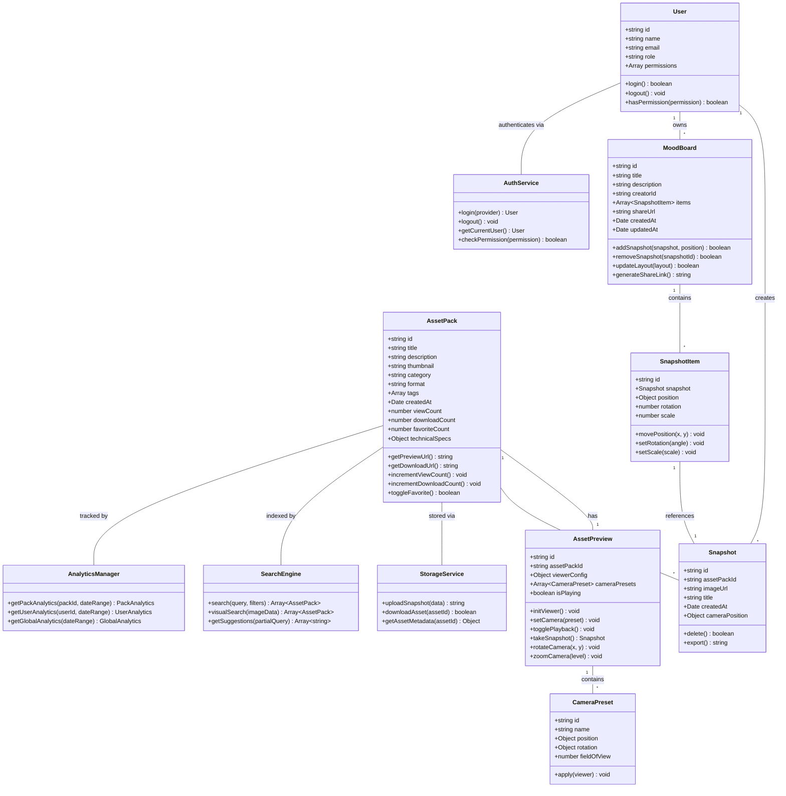
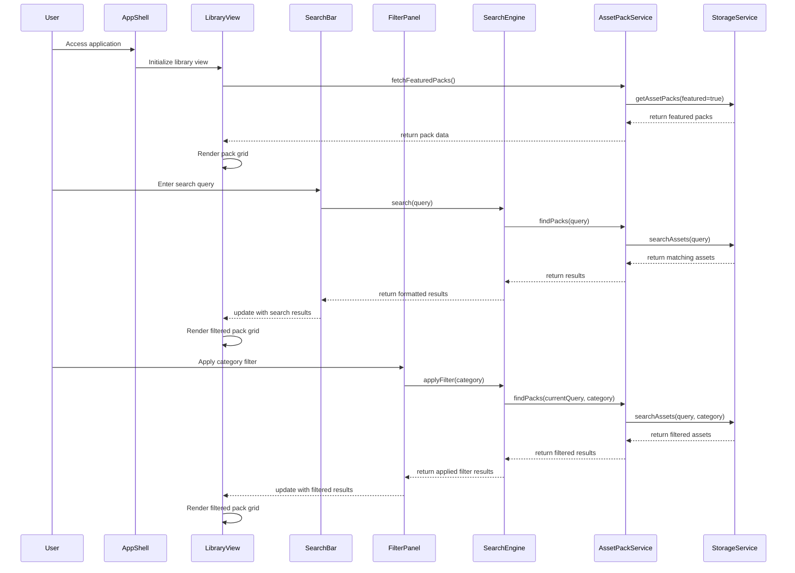
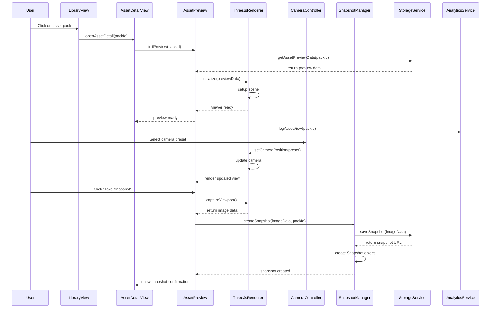
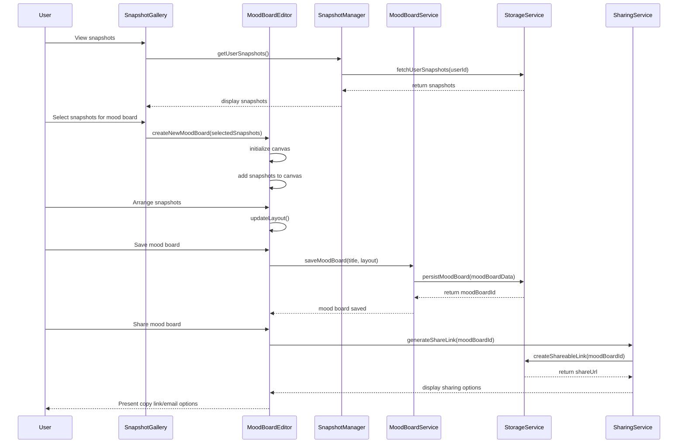
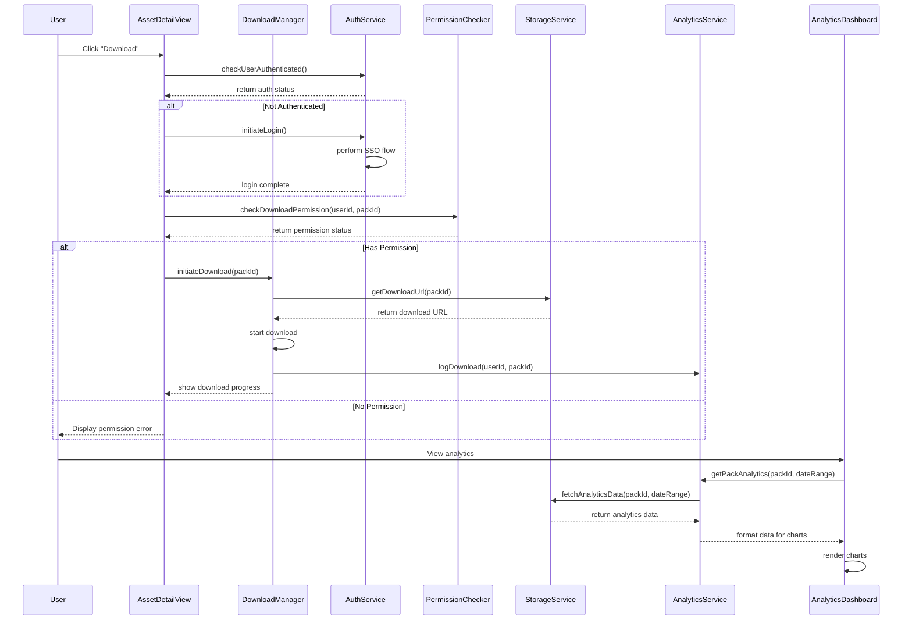

# Virtual Backlot Prototype - System Design

## Implementation approach

For the Virtual Backlot Prototype, we'll take a component-based approach using React, JavaScript, and Tailwind CSS, which allows for modular development and easier maintenance. The system will be designed as a single-page application (SPA) with a focus on smooth user experience and performance optimization for 3D content.

### Key Technology Choices

1. **Frontend Framework**: React with functional components and hooks for UI development
2. **Styling**: Tailwind CSS for responsive, utility-first styling
3. **State Management**: Redux for global state management with Redux Toolkit to simplify setup
4. **3D Visualization**: Three.js for browser-based 3D rendering (simulating Pixel Streaming)
5. **UI Components**: Headless UI components for accessibility-compliant interactive elements
6. **Authentication**: Mock OAuth/SSO implementation for the prototype
7. **Analytics**: Chart.js for data visualization in the analytics dashboard
8. **Storage**: Mock API services to simulate Oracle Cloud storage integration
9. **Routing**: React Router for navigation between different views

### Difficult Points & Solutions

1. **3D Asset Visualization**
   - Challenge: Browser-based 3D rendering performance
   - Solution: Use Three.js with optimized models and progressive loading; implement level-of-detail rendering

2. **Mood Board Collaboration**
   - Challenge: Intuitive drag-and-drop interface with real-time updates
   - Solution: Use React DnD (Drag and Drop) library with optimistic UI updates

3. **Search & Discovery**
   - Challenge: Implementing AI-powered visual search
   - Solution: For the prototype, implement keyword-based search with visual similarity sorting using pre-computed metadata

4. **Performance Optimization**
   - Challenge: Smooth experience with potentially large assets
   - Solution: Implement lazy loading, asset caching, and compressed thumbnails

## Data structures and interfaces

The application will use the following core data structures:

## Program call flow

Here is the detailed sequence diagram for the main user flows in the system:

### Library View and Search Flow

### Asset Preview and Snapshot Flow

### Mood Board Creation & Sharing Flow

### Download and Analytics Flow

## Persona-Specific Technical Considerations

### Marketing Executive Flow

- **Technical Priority**: Fast-loading image exports with high quality
- **Considerations**:
  - Implement client-side image processing for snapshot exports
  - Optimize the snapshot format for inclusion in presentation software
  - Focus on simplified category filtering with visual emphasis
  - Provide quick export in multiple formats (PNG, JPG, with transparent backgrounds)

### Showrunner Flow

- **Technical Priority**: Intuitive visual search and collaborative sharing
- **Considerations**:
  - Implement visual similarity algorithm for AI Wand feature
  - Create persistent, shareable mood board URLs
  - Ensure mood board sharing works across devices without login requirement for viewers
  - Optimize linking between searched assets and their addition to mood boards

### Director of Photography (DP) Flow

- **Technical Priority**: High-fidelity visual previews with camera control
- **Considerations**:
  - Implement accurate camera presets with proper focal length simulation
  - Support toggle between different lighting conditions with accurate rendering
  - Create smooth camera controls for professional evaluation
  - Provide technical metadata for each environment (dimensions, lighting setup)

### 3D Artist Flow

- **Technical Priority**: Detailed asset information and secure downloads
- **Considerations**:
  - Implement secure authentication flow with proper permission checking
  - Provide detailed technical specifications in the UI
  - Create download progress indicators with size estimation
  - Support format verification to ensure compatibility with artist workflows

## Cloud Storage Integration Points

For the prototype, we'll mock Oracle Cloud integration at these key points:

1. **Asset Metadata Storage**
   - Mock API: `GET /api/assets` - Returns list of asset packs with metadata
   - Mock API: `GET /api/assets/{id}` - Returns detailed information about a specific asset pack

2. **3D Preview Assets**
   - Mock API: `GET /api/assets/{id}/preview` - Returns preview data for Three.js renderer
   - Mock Service: Simulated streaming for 3D preview content

3. **User Data Storage**
   - Mock API: `GET /api/users/{id}/snapshots` - Returns user's saved snapshots
   - Mock API: `POST /api/users/{id}/snapshots` - Saves a new snapshot
   - Mock API: `GET /api/users/{id}/moodboards` - Returns user's mood boards
   - Mock API: `POST /api/users/{id}/moodboards` - Creates a new mood board

4. **Asset Download Service**
   - Mock API: `GET /api/assets/{id}/download` - Initiates asset download process
   - Mock Service: Simulated permission checking and download handling

5. **Analytics Data Storage**
   - Mock API: `GET /api/analytics/assets/{id}` - Returns usage analytics for specific asset
   - Mock API: `POST /api/analytics/events` - Records user interaction events

## Mobile Responsiveness Strategy

The system is designed primarily for desktop use, but will support tablet devices with these considerations:

1. **Responsive Grid Layout**: Adapts from 4-column on large screens to 2-column on tablets
2. **Touch-Optimized Controls**: All interaction points sized appropriately for touch input
3. **Selective Feature Availability**: Complex 3D editing limited on smaller devices
4. **Orientation Detection**: Optimized layouts for landscape vs portrait orientations

## Anything UNCLEAR

1. **Pixel Streaming Implementation**: The prototype will use Three.js to simulate Pixel Streaming functionality, but the PRD mentions wanting to toggle between real-time and offline render profiles. Clarification is needed on the level of fidelity required for this simulation.

2. **Authentication Details**: The exact SSO provider is not specified. The prototype will implement a generic OAuth flow that can be adapted to specific providers in the future.

3. **Analytics Scope**: The required depth of analytics tracking is not fully detailed. The prototype will implement basic view, download, and favorite tracking, but may need expansion based on stakeholder feedback.

4. **Asset Volume**: The expected number and size of assets in the library is not specified, which impacts storage and performance optimization strategies. The prototype will be designed to handle dozens of asset packs efficiently.

5. **User Permission Granularity**: The detailed permission structure beyond the four persona roles is not specified. The prototype will implement a basic role-based permission system that can be refined in future iterations.